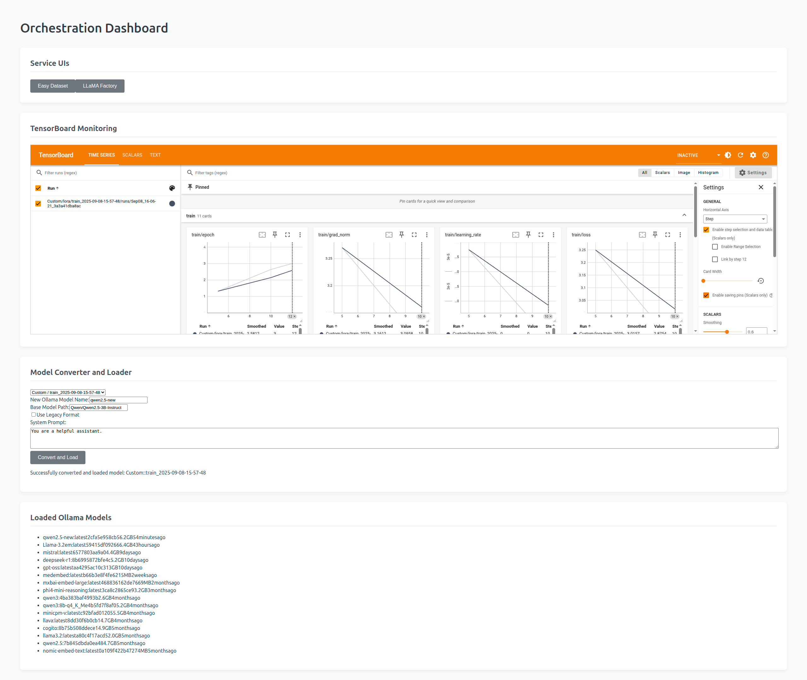

[](https://opensource.org/licenses/MIT)



# Fine-Tuning Orchestration Dashboard

This project provides a web-based dashboard to orchestrate and monitor `easy-dataset`, `LLaMA-Factory`, and other services, simplifying the workflow for fine-tuning large language models. Once a fine tuned model is generated (via LLama-Factory, though other solutions can be used), easily convert to GGUF using llama-cpp and then load the GGUF model to your local Ollama instance using the dashboard. 

## Features

-   **Service Orchestration:** A `docker-compose.yml` file to launch and manage all required services.
-   **Web-Based UI:** A clean, simple interface built with React to monitor the services.
-   **Containerized Deployment:** The entire application is containerized with Docker for easy and reproducible deployment.

## Getting Started

### Prerequisites

-   Docker and Docker Compose
-   An NVIDIA GPU with the appropriate drivers installed.
  
### Configuration

1.  **Clone the Repository:**
    ```bash
    git clone <repository-url>
    cd <repository-name>
    ```

2.  **Create and Configure the Environment File:**
    Copy the example environment file to a new `.env` file. This file is used to configure all the services.
    ```bash
    cp .env.example .env
    ```    Open the `.env` file and customize the variables as needed.

### Environment Variables

The following variables can be configured in the `.env` file:

*   `HF_TOKEN`: **(Required)** Your Hugging Face API token. This is necessary for downloading models.
*   `OLLAMA_API_URL`: The internal URL for the Ollama API, used by the backend. Defaults to `http://ollama:11434`.
*   `VITE_LLAMA_FACTORY_URL`: The public-facing URL for the LLaMA Factory service. Defaults to `http://localhost:7002`.
*   `VITE_EASY_DATASET_URL`: The public-facing URL for the Easy Dataset service. Defaults to `http://localhost:7001`.
*   `VITE_TENSORBOARD_URL`: The public-facing URL for the TensorBoard service. Defaults to `http://localhost:7003`.
*   `LLAMA_FACTORY_CONTAINER`: The name of the LLaMA Factory Docker container. Defaults to `finetune-llama-factory`.
*   `LLAMA_CPP_CONTAINER`: The name of the llama.cpp Docker container. Defaults to `finetune-llama-cpp`.
*   `OLLAMA_CONTAINER`: The name of the Ollama Docker container. Defaults to `ollama`.

### Running the Application

1.  **Build and Start the Services:**
    ```bash
    docker compose up --build -d
    ```

2.  **Access the Dashboard:**
    The main orchestration dashboard will be available at `http://localhost:3000`. From the dashboard, you can access the UIs for all other services.

## Usage

(Detailed usage instructions follow, as previously defined)
## Acknowledgements

This project would not be possible without the incredible work of the open-source community. We would like to extend our sincere gratitude to the developers and researchers behind the following projects:

*   **LLaMA Factory:** A powerful and flexible framework for fine-tuning large language models.
    ```bibtex
    @inproceedings{zheng2024llamafactory,
      title={LlamaFactory: Unified Efficient Fine-Tuning of 100+ Language Models},
      author={Yaowei Zheng and Richong Zhang and Junhao Zhang and Yanhan Ye and Zheyan Luo and Zhangchi Feng and Yongqiang Ma},
      booktitle={Proceedings of the 62nd Annual Meeting of the Association for Computational Linguistics (Volume 3: System Demonstrations)},
      address={Bangkok, Thailand},
      publisher={Association for Computational Linguistics},
      year={2024},
      url={http://arxiv.org/abs/2403.13372}
    }
    ```

*   **Easy Dataset:** An extensible framework for synthesizing fine-tuning data from unstructured documents.
    ```bibtex
    @misc{miao2025easydataset,
      title={Easy Dataset: A Unified and Extensible Framework for Synthesizing LLM Fine-Tuning Data from Unstructured Documents},
      author={Ziyang Miao and Qiyu Sun and Jingyuan Wang and Yuchen Gong and Yaowei Zheng and Shiqi Li and Richong Zhang},
      year={2025},
      eprint={2507.04009},
      archivePrefix={arXiv},
      primaryClass={cs.CL},
      url={https://arxiv.org/abs/2507.04009}
    }
    ```

*   **llama.cpp:** A high-performance C++ library for running language models.
*   **Ollama:** A tool for running and managing large language models locally.
*   **FastAPI:** A modern, fast (high-performance) web framework for building APIs with Python.
*   **React:** A JavaScript library for building user interfaces.
*   **Vite:** A fast and lightweight build tool for modern web development.
*   **Docker:** A platform for developing, shipping, and running applications in containers.
## License

This project is licensed under the MIT License. See the [LICENSE](LICENSE) file for details.
## Contributing

Contributions are welcome! Please see our [Contributing Guide](CONTRIBUTING.md) for more details on how to get started.

Please note that this project is released with a [Contributor Code of Conduct](CODE_OF_CONDUCT.md). By participating in this project you agree to abide by its terms.
