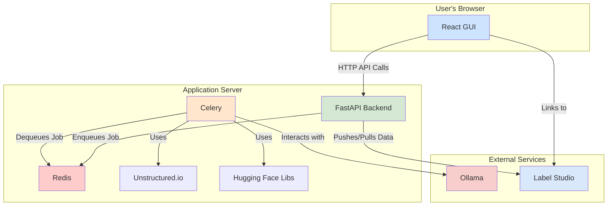

# Implementation Plan: General-Purpose Fine-Tuning Application

## Final Architecture

We will build a web application with a decoupled frontend and backend, using an asynchronous task queue to handle the heavy lifting of fine-tuning. The data pipeline will leverage powerful, specialized tools for document parsing and dataset annotation.

## Project Tasks

Here is the breakdown of the major tasks to build the application:

1.  **Setup Core Backend Architecture with FastAPI, Celery, and Redis** (Complexity: 7)
    *   Initialize a new FastAPI project. Configure Celery and Redis for asynchronous task processing. Create a basic project structure with separate modules for API endpoints, Celery tasks, and business logic. This forms the foundation of our service.

2.  **Initialize React Frontend with TypeScript** (Complexity: 6)
    *   Create a new React application using a standard tool like Create React App or Vite. Configure it to use TypeScript. Set up a basic project structure with components, services (for API calls), and a simple layout. This will be the user-facing part of the application.

3.  **Develop Data Ingestion and Processing Pipeline (Celery Task)** (Complexity: 8)
    *   Create a Celery task that accepts a file path. This task will use the Unstructured.io library to parse the document. After parsing, it will use a library like LlamaIndex or a custom script to generate a preliminary instruction-following dataset from the extracted text. This task is the first step in our data preparation workflow.

4.  **Integrate Label Studio for Dataset Annotation** (Complexity: 9)
    *   Create a Celery task that takes the generated dataset and pushes it to a Label Studio instance using the Label Studio SDK. The API will need an endpoint to trigger this and another endpoint to list approved datasets from Label Studio. The frontend will need a UI to initiate the push to Label Studio and then display the list of approved datasets available for fine-tuning. (This is complete).

5.  **Develop Core Fine-Tuning Logic (Celery Task)** (Complexity: 10)
    *   Create the main Celery task for fine-tuning. This task will accept a dataset from Label Studio, a base model identifier from Ollama, and hyperparameters. It will use the Hugging Face `transformers` and `peft` libraries to execute the fine-tuning job (e.g., using DoRA). The task must handle logging and status updates back to the main application. (This is complete).

6.  **Build Frontend UI for Fine-Tuning Workflow** (Complexity: 8)
    *   Develop the React components for the main user workflow: 1. A file upload component. 2. A view to manage datasets, including the button to push to Label Studio. 3. A form to select a base model, an approved dataset, and configure hyperparameters. 4. A dashboard to view the status of running fine-tuning jobs and see past results. (This is complete).

7.  **Implement API Endpoints for Workflow Orchestration** (Complexity: 7)
    *   Create the FastAPI endpoints that the frontend will call: 1. An endpoint to handle file uploads. 2. Endpoints to manage the dataset lifecycle (trigger processing, push to Label Studio, list from Label Studio). 3. An endpoint to start a new fine-tuning job (which will dispatch the Celery task). 4. An endpoint (potentially using WebSockets) to provide real-time status updates of running jobs. (This is complete).

8.  **Containerize Application with Docker** (Complexity: 8)
    *   Create Dockerfiles for the FastAPI backend, the React frontend, and the Celery worker. Create a `docker-compose.yml` file to orchestrate all the services, including the application containers, Redis, and Label Studio. This will ensure a consistent and reproducible development and deployment environment. (This is complete).