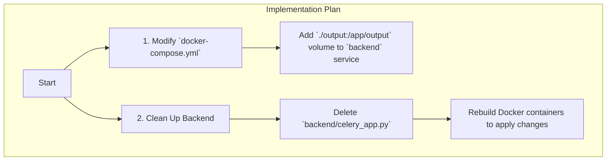

# Plan: Fix Model Discovery Workflow

## 1. Diagnosis

The investigation revealed that the frontend UI dropdown for selecting a fine-tuned model is empty because the backend API (`/api/models/finetuned`) is not returning any models.

**Root Cause:** The `backend` service in `docker-compose.yml` is missing a volume mount for the `./output` directory. This prevents the backend container from accessing the fine-tuned models generated by the `llama-factory` service, causing the API to correctly return an empty list.

## 2. Implementation Plan

The following steps will be taken to resolve the issue and perform necessary cleanup.

### **Step-by-Step Changes:**

1.  **Modify `docker-compose.yml`:**
    *   Add the volume mount `- ./output:/app/output` to the `backend` service definition. This is the critical fix that will allow the backend to see the fine-tuned models.

2.  **Delete Orphaned File:**
    *   Remove the file `backend/celery_app.py`.